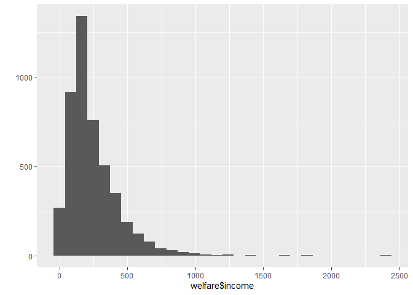
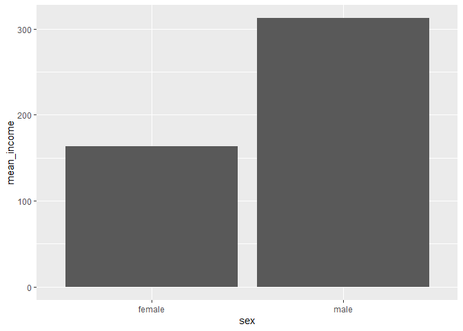

20200730\_2
================
주윤하
July 30, 2020

## 2\. 성별에 따른 월급 차이

과거에 비해 직장 내 여성의 대우가 좋아지긴 했으나, 여전히 차별은 존재합니다. 해당 분석을 통해 직장 내 성별 월급의 차이를
분석하도록 하겠습니다.

``` r
library(foreign)             # SPSS 파일 로드
library(dplyr)               # 전처리
library(ggplot2)             # 시각화
library(readxl)              # 엑셀 파일 불러오기
```

### 분석 절차

Koweps\_hpc10\_2015\_beta1.sav를 다운로드하여 프로젝트 파일에 추가시킨다.

``` r
welfare <-read.spss("Koweps_hpc10_2015_beta1.sav",
                        to.data.frame=T)
```

    ## Warning in read.spss("Koweps_hpc10_2015_beta1.sav", to.data.frame = T):
    ## Koweps_hpc10_2015_beta1.sav: Compression bias (0) is not the usual value of 100

### 성별 변수 검토 및 전처리

사용할 변수를 검토하고 이상치 결측처리 후 분석하도록 하겠습니다.

#### 1\. 변수 검토하기

사용할 변수인 sex를 검토.

``` r
welfare<-rename(welfare, 
                sex=h10_g3,
                marriage=h10_g10,
                religion=h10_g10,
                code_job=h10_eco9,
                income=p1002_8aq1,
                code_region=h10_reg7)
class(welfare$sex)
```

    ## [1] "numeric"

``` r
table(welfare$sex)
```

    ## 
    ##    1    2 
    ## 7578 9086

#### 2\. 전처리

데이터에 이상치가 있는지 검토하고 이상치를 제외할 수 있도록 NA를 부여합니다.

남성과 여성의 표기가 1과 2로 되어있으므로 분석하기 용이한 변수명으로 변경. 성별 항목 이름 부여 확인 및 값 확인 후 그래프로
출력.

``` r
welfare$sex <- ifelse(welfare$sex == 1, "male", "female")
table(welfare$sex)
```

    ## 
    ## female   male 
    ##   9086   7578

``` r
qplot(welfare$sex)
```

<!-- --> \#\#\#
월급 변수 검토 및 전처리 월급 변수인 income을 검토하고 qplot으로 분포를 분석

``` r
class(welfare$income)
```

    ## [1] "numeric"

``` r
summary(welfare$income)
```

    ##    Min. 1st Qu.  Median    Mean 3rd Qu.    Max.    NA's 
    ##     0.0   122.0   192.5   241.6   316.6  2400.0   12030

``` r
qplot(welfare$income)
```

    ## `stat_bin()` using `bins = 30`. Pick better value with `binwidth`.

    ## Warning: Removed 12030 rows containing non-finite values (stat_bin).

<!-- -->

#### 1\. 변수 검토하기

qplot을 이용하여 변수의 분포를 확인하였습니다.

#### 2\. 전처리

월급은 1\~9998 사이의 값을 지니며, 무응답은 9999로 코딩되어 있음을 알 수 있습니다. 9999의 값을 나타내는 부분을
결측처리 하겠습니다.

``` r
welfare$income <- ifelse(welfare$income %in% c(0, 9999), NA, welfare$income)
table(is.na(welfare$income))
```

    ## 
    ## FALSE  TRUE 
    ##  4620 12044

### 성별에 따른 월급 차이 분석하기

성별에 따른 월급차이를 분석하기 위해 group\_by와 summarise를 사용하도록 하겠습니다.

``` r
sex_income <- welfare %>% 
  filter(!is.na(income)) %>% 
  group_by(sex) %>% 
  summarise(mean_income=mean(income))
```

    ## `summarise()` ungrouping output (override with `.groups` argument)

#### 1\. 성별 월급 평균표 만들기

위의 분석한 자료를 출력해보기

``` r
sex_income
```

    ## # A tibble: 2 x 2
    ##   sex    mean_income
    ##   <chr>        <dbl>
    ## 1 female        163.
    ## 2 male          312.

#### 2\. 그래프 만들기

``` r
ggplot(data=sex_income, aes(x=sex, y=mean_income)) + geom_col()
```

<!-- -->
