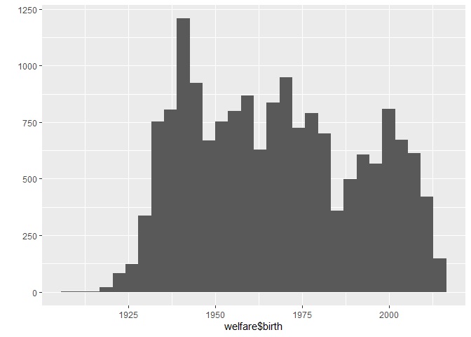

20200730\_3
================
주윤하
July 30, 2020

사용할 함수와 파일을 로드하여 데이터 분석작업 준비를 합니다.

welfare파일 로드

``` r
welfare <-read.spss("Koweps_hpc10_2015_beta1.sav",
                        to.data.frame=T)
```

    ## Warning in read.spss("Koweps_hpc10_2015_beta1.sav", to.data.frame = T):
    ## Koweps_hpc10_2015_beta1.sav: Compression bias (0) is not the usual value of 100

사용하기 편하도록 변수의 이름을 변경해줍니다.

``` r
welfare<-rename(welfare, 
                sex=h10_g3,
                marriage=h10_g10,
                religion=h10_g10,
                code_job=h10_eco9,
                income=p1002_8aq1,
                code_region=h10_reg7,
                birth=h10_g4)
```

## 3\. 나이와 월급의 관계

젊은이들이 세대 간의 소득 격차로 인한 사회적 불평등을 느낀다고 합니다. 해당내용을 나이와 월급과의 관계 분석을 통해 알아보도록
하겠습니다.

### 분석 절차

변수를 검토하고 전처리하여 변수 간의 관계를 분석하도록 하겠습니다.

#### 1\. 변수 검토하기

나이와 월급 두가지 변수를 검토합니다.

``` r
class(welfare$birth)
```

    ## [1] "numeric"

``` r
summary(welfare$birth)
```

    ##    Min. 1st Qu.  Median    Mean 3rd Qu.    Max. 
    ##    1907    1946    1966    1968    1988    2014

``` r
qplot(welfare$birth)
```

    ## `stat_bin()` using `bins = 30`. Pick better value with `binwidth`.

<!-- -->

#### 2\. 전처리

해당 내용 중 이상치를 결측 처리하도록 하겠습니다. 해당 범위는 1900\~2014년이며, 모름/ 무응답은 9999로 코딩되어
있습니다.

``` r
summary(welfare$birth)
```

    ##    Min. 1st Qu.  Median    Mean 3rd Qu.    Max. 
    ##    1907    1946    1966    1968    1988    2014

``` r
table(is.na(welfare$birth))
```

    ## 
    ## FALSE 
    ## 16664

해당 내용에는 결측치가 없어, 바로 분석을 진행하도록 하겠습니다.

#### 3\. 파생변수 만들기 - 나이

태어난 연도를 기준으로 나이 변수를 만들도록 하겠습니다.

``` r
welfare$age<-2015-welfare$birth + 1
summary(welfare$age)
```

    ##    Min. 1st Qu.  Median    Mean 3rd Qu.    Max. 
    ##    2.00   28.00   50.00   48.43   70.00  109.00

``` r
qplot(welfare$age)
```

    ## `stat_bin()` using `bins = 30`. Pick better value with `binwidth`.

<!-- -->

### 나이와 월급의 관계 분석하기

나이와 월급과의 관계를 분석하기 위해 group\_by와 summarise를 사용하도록 하겠습니다.

``` r
age_income <- welfare %>% 
  filter(!is.na(income)) %>% 
  group_by(age) %>% 
  summarise(mean_income=mean(income))
```

    ## `summarise()` ungrouping output (override with `.groups` argument)

#### 1\. 나이에 따른 월급 평균표 만들기

``` r
summary(age_income)
```

    ##       age         mean_income    
    ##  Min.   :20.00   Min.   : 15.00  
    ##  1st Qu.:37.00   1st Qu.: 98.05  
    ##  Median :54.00   Median :188.25  
    ##  Mean   :54.04   Mean   :176.75  
    ##  3rd Qu.:71.00   3rd Qu.:282.47  
    ##  Max.   :89.00   Max.   :318.68

#### 2\. 그래프 만들기

``` r
ggplot(data=age_income, aes(x=age, y=mean_income)) + geom_line()
```

<!-- -->
