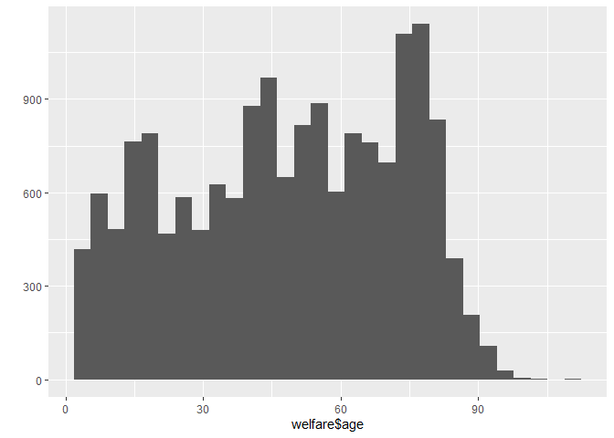
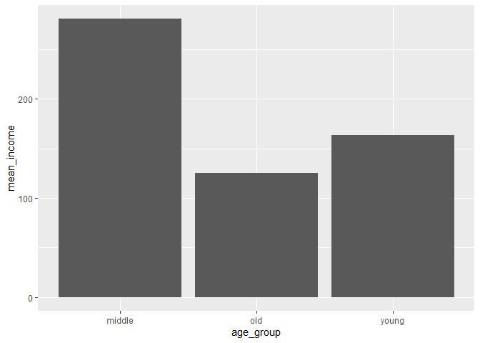
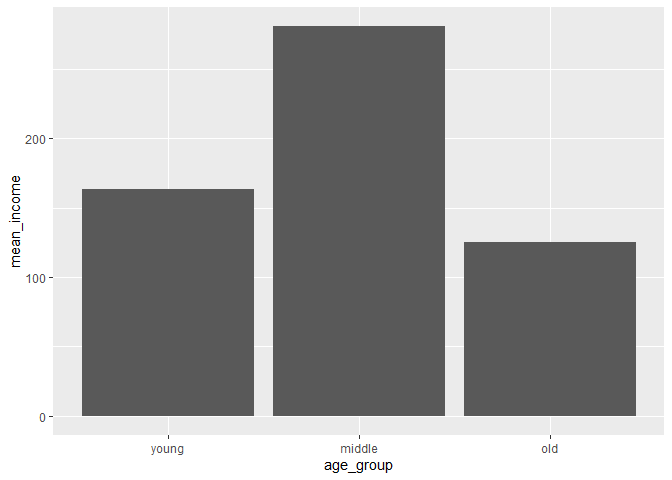

한국복지패널데이터 분석\_4
================
주윤하
July 30, 2020

``` r
library(foreign)             # SPSS 파일 로드
library(dplyr)               # 전처리
```

    ## 
    ## Attaching package: 'dplyr'

    ## The following objects are masked from 'package:stats':
    ## 
    ##     filter, lag

    ## The following objects are masked from 'package:base':
    ## 
    ##     intersect, setdiff, setequal, union

``` r
library(ggplot2)             # 시각화
library(readxl)              # 엑셀 파일 불러오기

# 데이터 불러오기
raw_welfare <- read.spss(file = "Koweps_hpc10_2015_beta1.sav",
                         to.data.frame = T)
```

    ## Warning in read.spss(file = "Koweps_hpc10_2015_beta1.sav", to.data.frame = T):
    ## Koweps_hpc10_2015_beta1.sav: Compression bias (0) is not the usual value of 100

``` r
# 복사본 만들기
welfare <- raw_welfare

# 변수 이름 변경하기기
welfare <- rename(welfare,
                  sex = h10_g3,            # 성별
                  birth = h10_g4,          # 태어난 연도
                  marriage = h10_g10,      # 혼인 상태
                  religion = h10_g11,      # 종교
                  income = p1002_8aq1,     # 월급
                  code_job = h10_eco9,     # 직종 코드
                  code_region = h10_reg7)  # 지역 코드

welfare$age<-2015-welfare$birth + 1
summary(welfare$age)
```

    ##    Min. 1st Qu.  Median    Mean 3rd Qu.    Max. 
    ##    2.00   28.00   50.00   48.43   70.00  109.00

``` r
qplot(welfare$age)
```

    ## `stat_bin()` using `bins = 30`. Pick better value with `binwidth`.

<!-- -->

## 4\. 연령대에 따른 월급 차이

나이에 따른 월급의 차이를 분석해보았고, 이번에는 연령대에 따른 월급의 차이를 분석해보도록 하겠습니다.

### 분석 절차

데이터의 구조를 먼저 확인합니다.

``` r
summary(welfare$age)
```

    ##    Min. 1st Qu.  Median    Mean 3rd Qu.    Max. 
    ##    2.00   28.00   50.00   48.43   70.00  109.00

### 연령대 변수 검토 및 전처리하기

age 데이터를 가공하여 연령대 파생변수를 만들도록 하겠습니다. 연령대는 30세 미만 = 초년, 59세 이하 = 중년, 60세
이상은 노년으로 분류합니다.

#### 1\. 파생변수 만들기 - 연령대

``` r
welfare <- welfare %>%
  mutate(age_group = ifelse(age <30, "young", ifelse(age <=59, "middle", "old")))
table(welfare$age_group)
```

    ## 
    ## middle    old  young 
    ##   6049   6281   4334

### 연령대에 따른 월급 차이 분석하기

연령대 파생변수와 월급 변수를 가지고 차이를 분석하도록 하겠습니다.

#### 1\. 연령대별 월급 평균표 만들기

``` r
agegroup_income <- welfare %>% 
  filter(!is.na(income)) %>%
  group_by(age_group) %>% 
  summarise(mean_income=mean(income))
```

    ## `summarise()` ungrouping output (override with `.groups` argument)

``` r
head(agegroup_income)
```

    ## # A tibble: 3 x 2
    ##   age_group mean_income
    ##   <chr>           <dbl>
    ## 1 middle           281.
    ## 2 old              125.
    ## 3 young            164.

#### 2\. 그래프 만들기

``` r
ggplot(data=agegroup_income, aes(x=age_group, y=mean_income)) + geom_col()
```

<!-- -->

#### 막대 정렬 : 초년, 중년, 노년 나이 순

``` r
ggplot(data=agegroup_income, aes(x=age_group, y=mean_income)) + geom_col() +
  scale_x_discrete(limits =c("young","middle","old"))
```

<!-- -->
