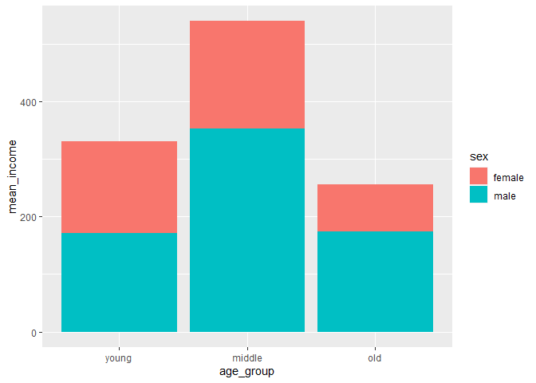
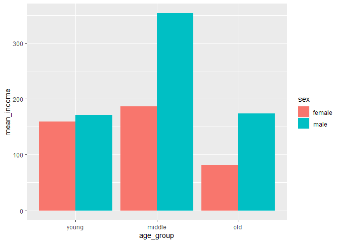

한국복지패널데이터\_5
================
주윤하
July 30, 2020

## 5\. 연령대 및 성별 월급 차이

앞선 분석에서 연령대별 급여차이, 성별 급여차이를 확인했습니다. 그렇다면 성별과 연령대의 급여차이를 한번에 확인하기 위한 분석
준비를 하도록 하겠습니다.

### 분석 절차

### 연령대 및 성별 월급 차이 분석하기

연령대와 성별을 한번에 표현하는 파생변수를 생성하고 평균표를 만들도록 하겠습니다.

#### 1\. 연령대 및 성별 월급 평균표 만들기

``` r
age_sex_income <- welfare %>% 
  filter(!is.na(income)) %>% 
  group_by(sex, age_group) %>% 
  summarise(mean_income = mean(income))
```

    ## `summarise()` regrouping output by 'sex' (override with `.groups` argument)

``` r
summary(age_sex_income)
```

    ##      sex             age_group          mean_income    
    ##  Length:6           Length:6           Min.   : 81.53  
    ##  Class :character   Class :character   1st Qu.:162.33  
    ##  Mode  :character   Mode  :character   Median :172.34  
    ##                                        Mean   :187.49  
    ##                                        3rd Qu.:183.09  
    ##                                        Max.   :353.08

``` r
head(age_sex_income)
```

    ## # A tibble: 6 x 3
    ## # Groups:   sex [2]
    ##   sex    age_group mean_income
    ##   <chr>  <chr>           <dbl>
    ## 1 female middle          186. 
    ## 2 female old              81.5
    ## 3 female young           160. 
    ## 4 male   middle          353. 
    ## 5 male   old             174. 
    ## 6 male   young           171.

#### 2\. 그래프 만들기

``` r
ggplot(data=age_sex_income, aes(x=age_group, y=mean_income, fill=sex)) +
  geom_col() +
  scale_x_discrete(limits = c("young", "middle", "old"))
```

<!-- --> \#\#\#\#
성별 막대 분리

``` r
ggplot(data=age_sex_income, aes(x=age_group, y=mean_income, fill=sex))+
  geom_col(position = "dodge")+
  scale_x_discrete(limits = c("young", "middle", "old"))
```

<!-- -->

### 나이 및 성별 월급 차이 분석하기

#### 그래프 만들기

``` r
sex_age<-welfare %>% 
  filter(!is.na(income)) %>% 
  group_by(age, sex) %>% 
  summarise(mean_income = mean(income))
```

    ## `summarise()` regrouping output by 'age' (override with `.groups` argument)

``` r
table(age_sex_income)
ggplot(data=sex_age, aes(x=age, y=mean_income, col=sex)) + geom_line()
```

<!-- -->
