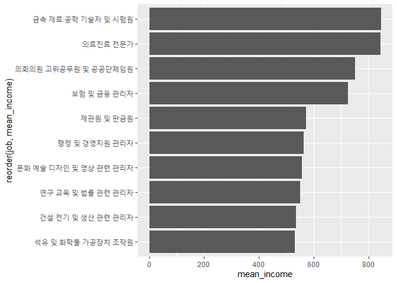
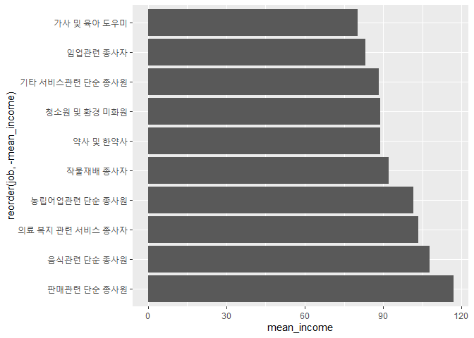

한국복지패널데이터\_6
================
주윤하
July 30, 2020

## 6\. 직업별 월급 차이

직업에 귀천이 없다고 하지만 대다수의 국민들이 직업별 월급의 차이가 있다고 생각합니다. 직업별 월급의 차이가 어느 정도인지 데이터
분석을 통해 확인해보도록 하겠습니다.

### 분석 절차

### 직업 변수 검토 및 전처리하기

직업변수의 데이터가 어떤식으로 구성되어있는지 확인해보도록 하겠습니다.

#### 1\. 변수 검토하기

code\_job의 변수를 검토하고 분석에 필요한 list\_job을 불러옵니다.

``` r
class(welfare$code_job)
```

    ## [1] "numeric"

``` r
library(readxl)
list_job <- read_excel("Koweps_Codebook.xlsx", col_names=T, sheet=2)
```

#### 2\. 전처리

code\_job에 해당되는 list\_job을 결합하여 분석에 용이하도록 전처리 합니다. 전처리 후 급여 기준 상위 10개
항목만 추출하여 데이터를 만듭니다.

``` r
welfare <- left_join(welfare, list_job, id="code_job")
```

    ## Joining, by = "code_job"

``` r
welfare %>% 
  filter(!is.na(code_job)) %>% 
  select(code_job, job) %>% 
  head(10)
```

### 직업별 월급 차이 분석하기

전처리한 job변수와 income변수를 사용하여 사이를 분석하도록 하겠습니다.

#### 1\. 직업별 월급 평균표 만들기

직업과 월급 사이의 관계를 알기위한 그래프를 만들기 위해 평균표를 작성합니다. group\_by로 직업을 묶어준 다음
summarise를 사용하여 급여 평균을 구해줍니다.

``` r
job_income <- welfare %>% 
  filter(!is.na(income)) %>% 
  group_by(job) %>% 
  summarise(mean_income = mean(income))
```

    ## `summarise()` ungrouping output (override with `.groups` argument)

#### 2\. 상위 10개 추출

``` r
job_income <- job_income %>% 
  arrange(desc(mean_income))
top10 <- job_income %>% 
  arrange(desc(mean_income)) %>% 
  head(10)
```

#### 3\. 그래프 만들기

``` r
ggplot(data=top10, aes(x=reorder(job, mean_income), y=mean_income)) +
  geom_col() +
  coord_flip()
```

<!-- -->

#### 4\. 하위 10위 추출

``` r
tail10 <- job_income %>% 
  arrange(mean_income) %>% 
  head(10)
head(tail10)
```

#### 5\. 그래프 만들기

``` r
ggplot(data = tail10, aes(x=reorder(job, -mean_income), y=mean_income))+
  geom_col()+coord_flip()
```

<!-- -->
