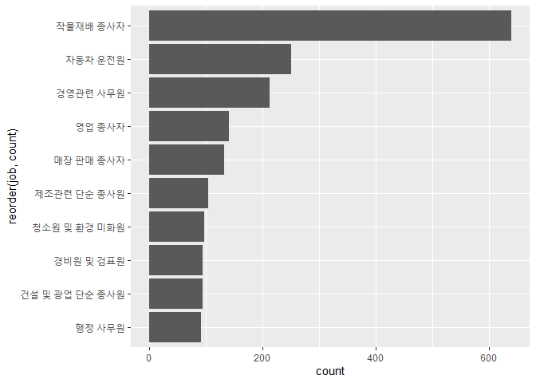
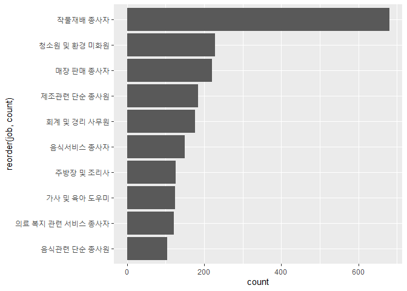

한국복지패널데이터_7
================
작성자
July 30, 2020

## 7\. 성별 직업 빈도

특정 직업은 여성 또는 남성의 비율이 확연하게 차이납니다. 이번에는 성별 직업 빈도를 분석하여 어떤 직업군에 특정 성별이 많은지
분석해보도록 하겠습니다.

### 분석 절차

  - 사용할 데이터를 검토하여 분석에 용이하도록 전처리합니다.
  - 성별 직업 빈도표를 작성합니다.
  - 빈도표를 기준으로 그래프를 작성합니다.

### 성별 직업 빈도 분석하기

#### 1\. 성별 직업 빈도표 만들기

여성과 남성으로 구분하여 직업으로 group\_by 하여 빈도표를 2개 생성합니다.

``` r
f_job <- welfare %>% 
  filter(!is.na(job) & sex == "male") %>% 
  group_by(job) %>% 
  summarise(count=n()) %>% 
  arrange(desc(count)) %>% 
  head(10)
```

    ## `summarise()` ungrouping output (override with `.groups` argument)

``` r
m_job <- welfare %>% 
  filter(!is.na(job) & sex == "female") %>% 
  group_by(job) %>% 
  summarise(count=n()) %>% 
  arrange(desc(count)) %>% 
  head(10)
```

    ## `summarise()` ungrouping output (override with `.groups` argument)

#### 2\. 그래프 만들기

여성 직업군 빈도표로 그래프를 만들어보겠습니다. 그래프는 보기 편하도록 coorp\_flip을 사용하도록 하겠습니다.

``` r
ggplot(data=f_job, aes(x=reorder(job, count), y=count))+
  geom_col() +
  coord_flip()
```

<!-- -->

남성 직업군의 그래프를 그리도록 하겠습니다. 여성 직업군 그래프와 동일하게 coord\_flip을 사용합니다.

``` r
ggplot(data=m_job, aes(x=reorder(job, count), y=count))+
  geom_col() +
  coord_flip()
```

<!-- -->
