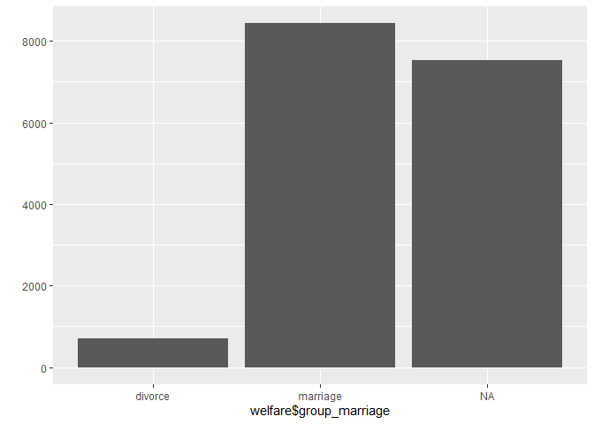
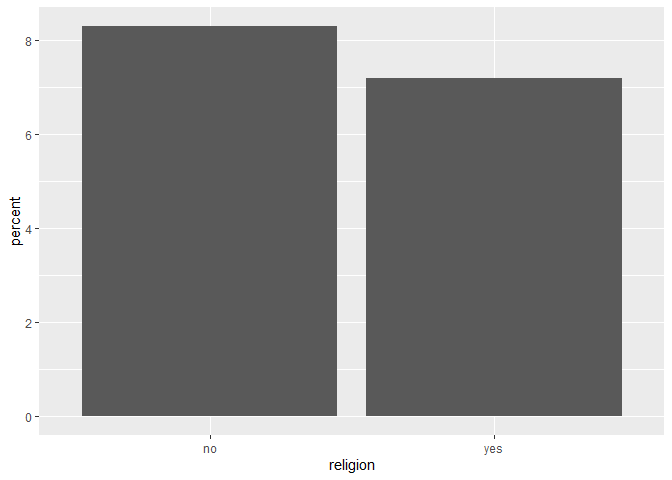
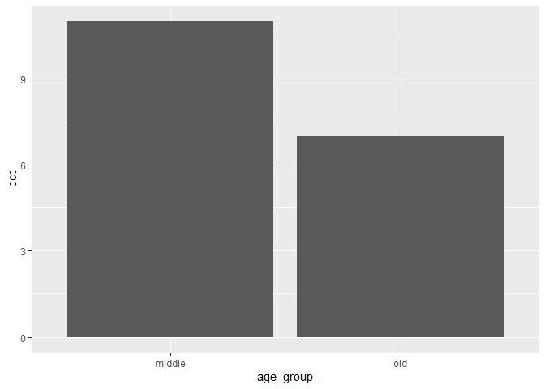
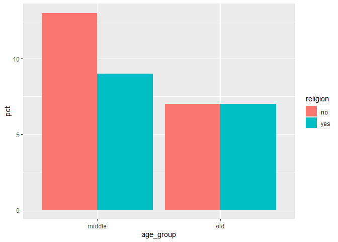

한국복지패널데이터\_8
================
주윤하
July 30, 2020

## 8\. 종교 유무에 따른 이혼율

수많은 종류의 종교가 존재하고, 종교가 있는 사람과 없는 사람이 존재합니다. 종교의 유무와 이혼율이 어떤 관계가 있는지
분석해보도록 하겠습니다.

### 분석 절차

  - 사용할 변수를 검토하여 분석에 용이하도록 전처리 합니다.
  - 전처리 한 변수를 사용하여 표를 작성합니다.
  - 표를 사용하여 그래프를 작성합니다.

### 종교 변수 검토 및 전처리하기

종교 변수는 어떤 형태의 데이터를 담고 있는지, 이상변수는 없는지 확인 후 필요한 경우 전처리하여 분석하도록 하겠습니다.

#### 1\. 변수 검토하기

종교 변수 검토하기

``` r
summary(welfare$religion)
```

    ##    Min. 1st Qu.  Median    Mean 3rd Qu.    Max. 
    ##   1.000   1.000   2.000   1.517   2.000   2.000

``` r
table(welfare$religion)
```

    ## 
    ##    1    2 
    ## 8047 8617

변수를 검토한 결과 종교가 있음은 “1”, 없음은 “2”로 표시되어 있습니다. 분석에 용이하도록 값을 변경하는 전처리를 진행하도록
합니다.

종교 여부의 응답인 1, 2를 yes와 no로 변경합니다.

``` r
welfare$religion <- ifelse(welfare$religion == 1, "yes", "no")
```

### 혼인 상태 변수 검토 및 전처리하기

#### 1\. 변수 검토하기

이혼 변수는 ‘혼인상태’ 변수를 가공하여 사용하도록 합니다.

#### 2\. 전처리

이혼 여부 변수를 만들도록 하겠습니다.

``` r
welfare$group_marriage <- ifelse(welfare$marriage == 1, "marriage",
                                 ifelse(welfare$marriage == 3, "divorce", NA))
table(welfare$group_marriage)
```

    ## 
    ##  divorce marriage 
    ##      712     8431

``` r
qplot(welfare$group_marriage)
```

<!-- -->

### 종교 유무에 따른 이혼율 분석하기

#### 1\. 종교 유무에 따른 이혼율 표 만들기

결혼을 유지하는 부부와 이혼한 부부, 종교가 있는 사람, 없는 사람의 값을 추출하여 표를 만들어 준 다음 필요한 변수만 추출하여
이혼율 표를 만들도록 하겠습니다.

``` r
religion_marriage <- welfare %>% 
  filter(!is.na(group_marriage)) %>% 
  group_by(religion, group_marriage) %>% 
  summarise(count=n()) %>% 
  mutate(tot_group = sum(count)) %>% 
  mutate(percent = round(count/sum(count)*100,1))
```

    ## `summarise()` regrouping output by 'religion' (override with `.groups` argument)

``` r
religion_marriage
```

    ## # A tibble: 4 x 5
    ## # Groups:   religion [2]
    ##   religion group_marriage count tot_group percent
    ##   <chr>    <chr>          <int>     <int>   <dbl>
    ## 1 no       divorce          384      4602     8.3
    ## 2 no       marriage        4218      4602    91.7
    ## 3 yes      divorce          328      4541     7.2
    ## 4 yes      marriage        4213      4541    92.8

#### 2\. 이혼율 표 만들기

앞서 만든 결혼, 종교 표에서 종교 변수와 이혼 값을 추출하여 이혼율 표를 만들도록 하겠습니다.

``` r
divorce <- religion_marriage %>% 
  filter(group_marriage == "divorce") %>% 
  select(religion, percent)
table(divorce)
```

    ##         percent
    ## religion 7.2 8.3
    ##      no    0   1
    ##      yes   1   0

#### 3\. 그래프 만들기

앞서 만든 이혼율 표를 바탕으로 그래프를 그리도록 하겠습니다.

``` r
ggplot(data=divorce, aes(x=religion, y=percent)) + geom_col()
```

<!-- -->

데이터를 분석한 결과 종교가 없는 사람들의 이혼율이 1.1% 높다는 것을 추측할 수 있습니다.

### 연령대 및 종교 유무에 따른 이혼율 분석하기

앞서 종교유 유무에 따른 이혼율에 연령대라는 변수를 추가하여 분석해보도록 하겠습니다.

#### 1\. 연령대별 이혼율 표 만들기

``` r
ageg_marriage <- welfare %>% 
  filter(!is.na(group_marriage)) %>% 
  group_by(age_group, group_marriage) %>% 
  summarise(count=n()) %>% 
  mutate(tot_group = sum(count)) %>% 
  mutate(pct=round(count/tot_group*100), 1)
```

    ## `summarise()` regrouping output by 'age_group' (override with `.groups` argument)

``` r
ageg_marriage
```

    ## # A tibble: 6 x 6
    ## # Groups:   age_group [3]
    ##   age_group group_marriage count tot_group   pct   `1`
    ##   <chr>     <chr>          <int>     <int> <dbl> <dbl>
    ## 1 middle    divorce          408      3697    11     1
    ## 2 middle    marriage        3289      3697    89     1
    ## 3 old       divorce          273      4165     7     1
    ## 4 old       marriage        3892      4165    93     1
    ## 5 young     divorce           31      1281     2     1
    ## 6 young     marriage        1250      1281    98     1

#### 2\. 연령대별 이혼율 그래프 만들기

위 표에서 보면 young그룹의 경우 다른 연령대에 비해 사례가 부족한 것을 알 수 있습니다. 따라서 연령대별 이혼율 측정 시
young그룹은 제외하도록 하겠습니다.

``` r
ageg_divorce <- ageg_marriage %>% 
  filter(age_group != "young" & group_marriage == "divorce") %>%
  select(age_group, pct)

ggplot(data=ageg_divorce, aes(x=age_group, y=pct)) + geom_col()  
```

<!-- -->

그래프를 확인해보면 중년의 이혼율이 노년의 이혼율보다 높음을 알 수 있습니다.

#### 3\. 연령대 및 종교 유무에 따른 이혼율 표 만들기

``` r
ageg_religion_marriage <- welfare %>% 
  filter(!is.na(group_marriage) & age_group != "young") %>% 
  group_by(age_group, religion, group_marriage) %>% 
  summarise(n=n()) %>% 
  mutate(tot_group = sum(n)) %>% 
  mutate(pct = round(n/tot_group*100), 1)
```

    ## `summarise()` regrouping output by 'age_group', 'religion' (override with `.groups` argument)

``` r
ageg_religion_marriage
```

    ## # A tibble: 8 x 7
    ## # Groups:   age_group, religion [4]
    ##   age_group religion group_marriage     n tot_group   pct   `1`
    ##   <chr>     <chr>    <chr>          <int>     <int> <dbl> <dbl>
    ## 1 middle    no       divorce          238      1895    13     1
    ## 2 middle    no       marriage        1657      1895    87     1
    ## 3 middle    yes      divorce          170      1802     9     1
    ## 4 middle    yes      marriage        1632      1802    91     1
    ## 5 old       no       divorce          123      1884     7     1
    ## 6 old       no       marriage        1761      1884    93     1
    ## 7 old       yes      divorce          150      2281     7     1
    ## 8 old       yes      marriage        2131      2281    93     1

#### 연령대 및 종교 유무별 이혼율 표 만들기

``` r
ageg_religion_divorce <- ageg_religion_marriage %>% 
  filter(group_marriage == "divorce") %>% 
  select(age_group, religion, pct)
ageg_religion_divorce
```

    ## # A tibble: 4 x 3
    ## # Groups:   age_group, religion [4]
    ##   age_group religion   pct
    ##   <chr>     <chr>    <dbl>
    ## 1 middle    no          13
    ## 2 middle    yes          9
    ## 3 old       no           7
    ## 4 old       yes          7

#### 4\. 연령대 및 종교 유무에 따른 이혼율 그래프 만들기

``` r
ggplot(data=ageg_religion_divorce, aes(x=age_group, y=pct, fill= religion)) + geom_col(position = "dodge")
```

<!-- -->

분석 결과 중년의 이혼율이 높고, 그 중 종교가 없는 사람들의 이혼율이 1.8% 더 높다는 것을 알 수 있습니다.
