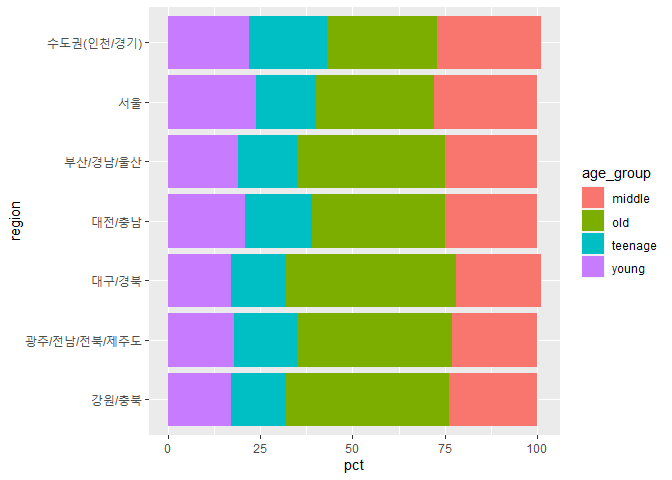

한국복지패널데이터\_9
================
주윤하
July 30, 2020

## 9\. 지역별 연령대 비율

도시에 인구가 집중되는 현상이 심화되면서, 지방과 도시 사이의 연령대 비율이 확연히 차이나고 있습니다. 이번에는 지역과 연령대
데이터를 사용하여 관계를 분석하도록 하겠습니다.

### 분석 절차

  - 사용할 데이터를 검토하여 전처리를 합니다.
  - 전처리 한 데이터를 바탕으로 표를 작성합니다.
  - 표를 사용하여 그래프를 작성한 뒤 분석합니다.

### 지역 변수 검토 및 전처리하기

#### 1\. 변수 검토하기

``` r
summary(welfare$code_region)
```

    ##    Min. 1st Qu.  Median    Mean 3rd Qu.    Max. 
    ##   1.000   2.000   3.000   3.705   6.000   7.000

``` r
summary(welfare$age_ground)
```

    ## Length  Class   Mode 
    ##      0   NULL   NULL

``` r
table(welfare$age_ground)
```

    ## < table of extent 0 >

#### 2\. 전처리

지역명이 숫자로 기입되어있으므로, 분석에 용이하도록 코드 별 지역명으로 변경하여 파생변수를 생성합니다.

#### `welfare`에 지역명 변수 추가

``` r
list_region <- data.frame(code_region = c(1:7),
                          region=c("서울",
                                   "수도권(인천/경기)",
                                   "부산/경남/울산",
                                   "대구/경북",
                                   "대전/충남",
                                   "강원/충북",
                                   "광주/전남/전북/제주도"))
list_region
```

    ##   code_region                region
    ## 1           1                  서울
    ## 2           2     수도권(인천/경기)
    ## 3           3        부산/경남/울산
    ## 4           4             대구/경북
    ## 5           5             대전/충남
    ## 6           6             강원/충북
    ## 7           7 광주/전남/전북/제주도

``` r
welfare <- left_join(welfare, list_region, id="code_region")
```

    ## Joining, by = "code_region"

### 지역별 연령대 비율 분석하기

#### 1\. 지역별 연령대 비율표 만들기

group\_by로 지역과 연령을 묶어 각 변수의 갯수를 구하고 비율을 구합니다.

``` r
region_age <- welfare %>% 
  group_by(region, age_group) %>% 
  summarise(count=n()) %>% 
  mutate(tot_age=sum(count)) %>% 
  mutate(pct= round(count/tot_age*100),1)
```

    ## `summarise()` regrouping output by 'region' (override with `.groups` argument)

``` r
region_age
```

    ## # A tibble: 28 x 6
    ## # Groups:   region [7]
    ##    region                age_group count tot_age   pct   `1`
    ##    <chr>                 <chr>     <int>   <int> <dbl> <dbl>
    ##  1 강원/충북             middle      298    1257    24     1
    ##  2 강원/충북             old         555    1257    44     1
    ##  3 강원/충북             teenage     191    1257    15     1
    ##  4 강원/충북             young       213    1257    17     1
    ##  5 광주/전남/전북/제주도 middle      665    2922    23     1
    ##  6 광주/전남/전북/제주도 old        1233    2922    42     1
    ##  7 광주/전남/전북/제주도 teenage     502    2922    17     1
    ##  8 광주/전남/전북/제주도 young       522    2922    18     1
    ##  9 대구/경북             middle      460    2036    23     1
    ## 10 대구/경북             old         928    2036    46     1
    ## # ... with 18 more rows

#### `count()` 활용

위와 동일한 값을 추출하는 다른 방식으로 count를 사용하여 수식을 더욱 짧게 작성할 수 있습니다.

``` r
region_age <- welfare %>% 
 count(region, age_group) %>% 
  group_by(region) %>% 
  mutate(pct= round(n/sum(n)*100),1)
region_age
```

    ## # A tibble: 28 x 5
    ## # Groups:   region [7]
    ##    region                age_group     n   pct   `1`
    ##    <chr>                 <chr>     <int> <dbl> <dbl>
    ##  1 강원/충북             middle      298    24     1
    ##  2 강원/충북             old         555    44     1
    ##  3 강원/충북             teenage     191    15     1
    ##  4 강원/충북             young       213    17     1
    ##  5 광주/전남/전북/제주도 middle      665    23     1
    ##  6 광주/전남/전북/제주도 old        1233    42     1
    ##  7 광주/전남/전북/제주도 teenage     502    17     1
    ##  8 광주/전남/전북/제주도 young       522    18     1
    ##  9 대구/경북             middle      460    23     1
    ## 10 대구/경북             old         928    46     1
    ## # ... with 18 more rows

#### 2\. 그래프 만들기

앞서 만든 region\_age 데이터를 바탕으로 지역별 연령층 분포도 그래프를 그리도록 하겠습니다.

``` r
ggplot(data = region_age, aes(x=region, y=pct, fill=age_group)) + geom_col() + coord_flip()
```

<!-- -->

#### 3\. 막대 정렬하기 : 노년층 비율 높은 순

노년층 비율이 높은순으로 정렬하기 위해 노년층을 표에서 분리, 값이 높은 순서로 정렬, 해당 순서로 데이터 추출을 진행합니다.

``` r
list_order_old <- region_age %>% 
  filter(age_group == "old") %>% 
  arrange(pct)

list_order_old
```

    ## # A tibble: 7 x 5
    ## # Groups:   region [7]
    ##   region                age_group     n   pct   `1`
    ##   <chr>                 <chr>     <int> <dbl> <dbl>
    ## 1 수도권(인천/경기)     old        1109    30     1
    ## 2 서울                  old         805    32     1
    ## 3 대전/충남             old         527    36     1
    ## 4 부산/경남/울산        old        1124    40     1
    ## 5 광주/전남/전북/제주도 old        1233    42     1
    ## 6 강원/충북             old         555    44     1
    ## 7 대구/경북             old         928    46     1

``` r
order <- list_order_old$name_region
```

    ## Warning: Unknown or uninitialised column: `name_region`.

#### 4\. 연령대 순으로 막대 색깔 나열하기

위에서 노년층이 많이 거주하는 지역을 추출한 데이터를 scale\_x\_discrete에 적용하여 노년층이 많이 거주는 지역을
기준으로 정렬합니다.

``` r
ggplot(data=region_age, aes(x=region, y=pct, fill=age_group))+
  geom_col() + coord_flip() +
  scale_x_discrete(limits = order)
```

<!-- -->
