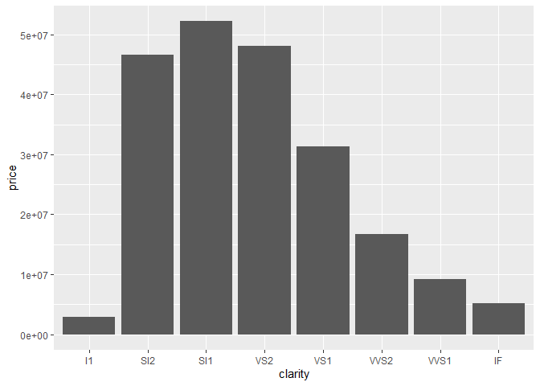
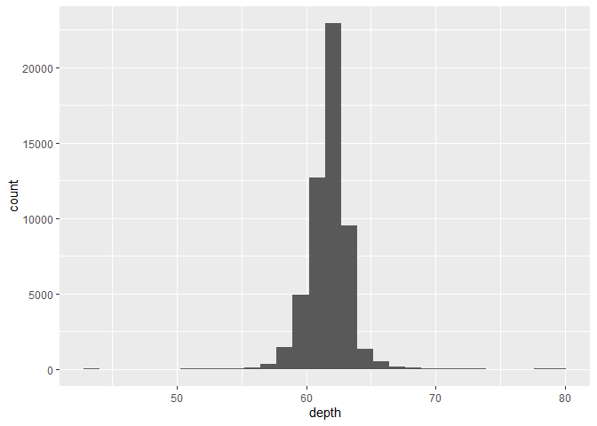
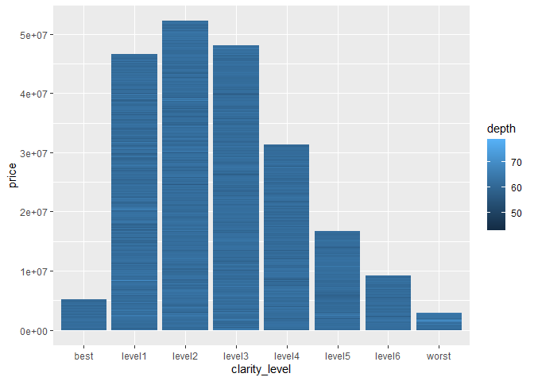
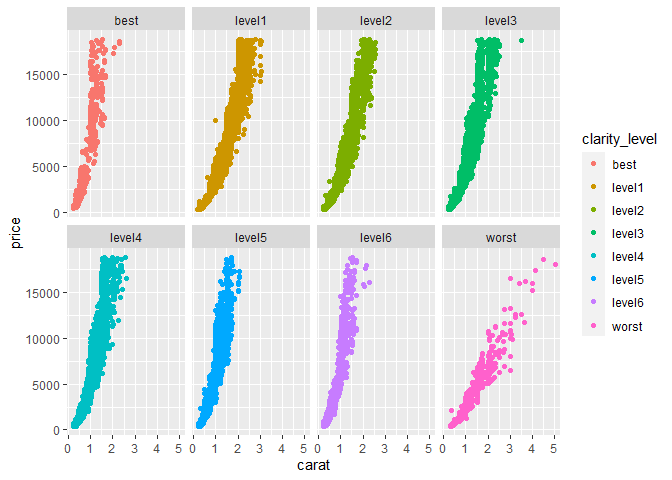

다이아몬드 분석
================
주윤하
August 11, 2020

# 1\. 다이아몬드 가격에 영향을 주는 요인 분석

비싼 보석으로 널리 알려진 다이아몬드는 가공하는 과정에서 다양한 요인에 의해 가격이 변하게 됩니다. 그 가격의 요인에 영향을 주는
것 중 depth와 clarity의 관계를 분석해보도록 하겠습니다.

## 데이터 분석 과정

  - 사용할 데이터 로드 후 전처리
  - 데이터 분석표 작성
  - 그래프를 통한 분석 진행

### 1\. 사용할 데이터 로드 및 형태 파악

``` r
glimpse(diamonds$clarity)
```

    ##  Ord.factor w/ 8 levels "I1"<"SI2"<"SI1"<..: 2 3 5 4 2 6 7 3 4 5 ...

``` r
glimpse(diamonds$depth)
```

    ##  num [1:53940] 61.5 59.8 56.9 62.4 63.3 62.8 62.3 61.9 65.1 59.4 ...

``` r
table(is.na(diamonds$depth))
```

    ## 
    ## FALSE 
    ## 53940

``` r
table(is.na(diamonds$price))
```

    ## 
    ## FALSE 
    ## 53940

``` r
ggplot(diamonds, aes(x=clarity, y=price))+geom_col()
```

<!-- -->

``` r
ggplot(diamonds, aes(x=depth)) + geom_histogram()
```

    ## `stat_bin()` using `bins = 30`. Pick better value with `binwidth`.

<!-- -->

데이터의 형태와 결측치를 확인한 결과 clarity는 범위형이며 depth는 연속형임을 알 수 있습니다.

depth는 histogram으로 볼 때, 값이 60\~65 사이에 모여있음을 알 수 있습니다. depth 데이터의 범위 자체가
한정적이므로depth값에 따른 가격의 변화는 크지 않을 수 있다고 예측해 볼 수 있습니다.

### 2\. 전처리

``` r
clarity_level <- c("worst", "level1","level2","level3","level4","level5","level6", "best")
clarity <- c("I1", "SI2", "SI1", "VS2", "VS1", "VVS2", "VVS1", "IF")

clarity1 <- data.frame(clarity_level, clarity)


diamonds2 <- diamonds %>% 
  left_join(clarity1, by="clarity") %>% 
  group_by(clarity_level)
```

clarity에서 범위값의 이름을 인지하기 편하도록 level로 변경하기 위해서 데이터 프레임을 추가하고 left\_join을
사용하여 추가줍니다.

### 3\. 그래프

``` r
 ggplot(diamonds2, aes(x=clarity_level, y=price, fill=depth)) + geom_col()
```

<!-- -->

### 4\. 분석 결과

예상한 것과 같이 depth의 경우 60\~65에 값이 모여있었기 때문에 가격과의 관계를 찾을 수 없었습니다. clarity의
경우 투명도가 높을 수록 가격이 높을 것으로 예상했지만 다소 낮은 단계인 level1\~level3에 높은 가격의
다이아몬드가 분포해 있음을 알 수 있습니다.

### 5\. 추가 분석

그렇다면 다이아몬드의 level을 뛰어넘는 가격의 영향을 주는 요인은 무엇이고 그것과 clarity와의 관계는 어떤지 분석해보도록
하겠습니다.

### 5\_1. carat, clarity, price의 관계

``` r
diamonds3 <- diamonds %>% 
  left_join(clarity1, by="clarity") %>% 
  group_by(clarity_level)
```

``` r
ggplot(diamonds3, aes(x=carat, y=price, color=clarity_level))+geom_point()+ facet_wrap(~clarity_level,nrow=2)
```

<!-- -->

그래프를 볼 때 carat은 대부분의 경우 1\~3 사이에 값이 존재하며, clarity가 가장 낮은 worst 단계는 높은
가격의 다이아몬드가 많지 않음을 알 수 있습니다. 위로 갈수록 두꺼워지는 형태인 level1, 2, 3, 4 의 경우
비싼 다이아몬드가 많이 속한 범위임을 알 수 있습니다.

### 6\. 최종 분석

다이아몬드의 가격 형성에 영향을 주는 요인을 분석해보았습니다. clarity, depth, carat을 분석해보았는데,
clarity와 carat은 가격에 영향을 주는 요인이지만, clarity의 경우 영향력이 크지 않음을 알 수 있습니다.

### 7\. 논의

  - 한계점 : 각 변수에 대한 이해도가 높지 않아 결과를 도출할만한 변수 선택에 오류가 있었고, 그로인해 가격 형성에 영향을
    주는 주요 요인을 도출하지 못했다. 데이터를 분석하기 전에 해당 데이터에 대한 기본적인 정보를 조사한 뒤 적절한 변수
    선정이 필요하다.
