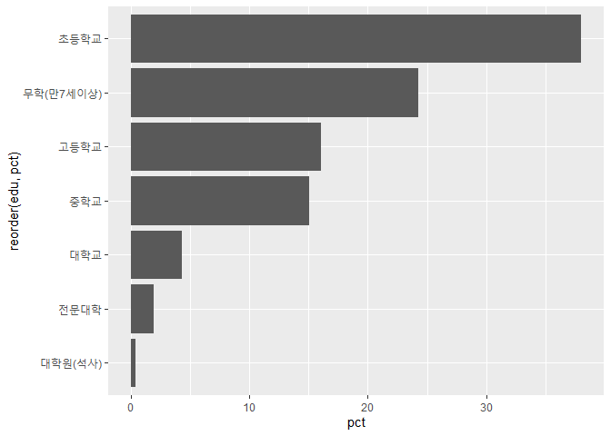
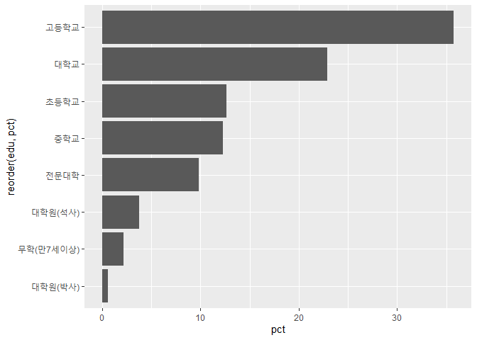
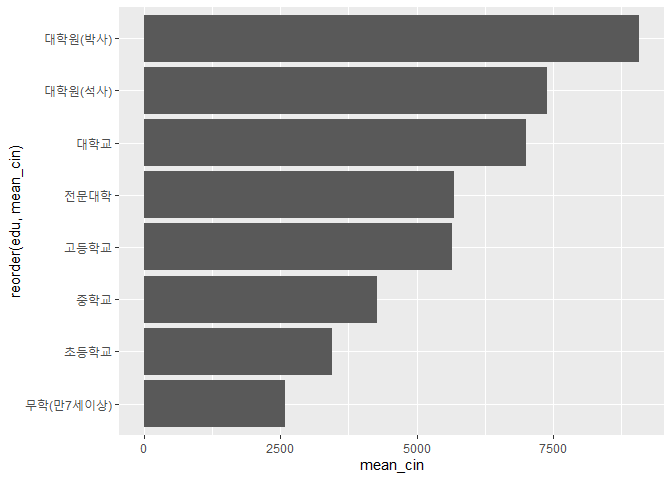

학력과 급여 사이의 관계
================
주윤하
2020 7 31

# 학력과 소득수준 사이의 관계

한국 사회에서 학력은 성공과 연관되는 중요한 요소라고 생각합니다. 그런 이유에서 매년 입시 경쟁은 치열해지고 학부모들의 사교육
열풍은 심해져가는 추세입니다. 한국복지패널데이터 중 학력과 소득수준, 경상소득의 데이터를 사욯하여 소득수준과 학력과의
관계를 분석해보도록 하겠습니다.

## 1\. 데이터 분석 과정

  - 사용할 데이터를 검토합니다.

  - 검토한 데이터를 전처리하여 분석에 용이하도록 작업합니다.

  - 전처리 한 데이터를 사용하여 분석표를 작성합니다.

  - 분석표를 바탕으로 그래프를 그리고 분석합니다.

해당 조사의 표본은 가구 기준이며, 학력 데이터는 가구주 또는 가구주 배우자 기준으로 작성되었습니다. 따라서 해당 데이터에서
미성년자에 해당되는 값은 없으므로 결측처리 없이 사용하였습니다. (미취학(7세미만)에 해당되는 값은 NA처리 후 사용)

``` r
summary(welfare_data$education) 
```

    ##    Min. 1st Qu.  Median    Mean 3rd Qu.    Max. 
    ##   2.000   3.000   5.000   4.511   5.000   9.000

``` r
summary(welfare_data$income)
```

    ##    Min. 1st Qu.  Median    Mean 3rd Qu.    Max. 
    ##   1.000   1.000   1.000   1.418   2.000   2.000

#### 1\. 데이터 전처리

사용할 데이터의 변수명을 분석하기 용이하도록 변경합니다. 사용할 변수의 값 이름이 숫자로 기재되어 있으므로 해당 값을 보기 편하게
변경합니다.

``` r
income_edu <- welfare_data %>% 
  select(income, education) %>% 
  mutate(grade = ifelse(income == 2, "low_income", "middle_income"))

summary(welfare_data$grade)
```

    ## Length  Class   Mode 
    ##      0   NULL   NULL

``` r
list_edu <- data.frame(education = c(1:9),
                          edu=c(NA,
                                   "무학(만7세이상)",
                                   "초등학교",
                                   "중학교",
                                   "고등학교",
                                   "전문대학",
                                   "대학교",
                                "대학원(석사)",
                                "대학원(박사)"))

income_edu <- left_join(income_edu, list_edu, id="education") 
```

    ## Joining, by = "education"

#### 2\. 저소득층 분석표 만들기

저소득층과 일반계층의 학력과 분석표를 각각 만들어 비교하기 위해 먼저 저소득층의 학력 분석표를 만들도록 하겠습니다.

``` r
low_income_edu<- income_edu %>% 
  filter(income == 2 & !is.na(education)) %>% 
  group_by(edu) %>% 
  summarise(count=n())
```

    ## `summarise()` ungrouping output (override with `.groups` argument)

``` r
head(low_income_edu)
```

    ## # A tibble: 6 x 2
    ##   edu             count
    ##   <chr>           <int>
    ## 1 고등학교          463
    ## 2 대학교            125
    ## 3 대학원(석사)       12
    ## 4 무학(만7세이상)   701
    ## 5 전문대학           55
    ## 6 중학교            434

#### 2\_1. 일반소득층 학력 분석표 만들기

``` r
middle_income_edu<- income_edu %>% 
  filter(income == 1 & !is.na(education)) %>% 
  group_by(edu) %>% 
  summarise(count=n())
```

    ## `summarise()` ungrouping output (override with `.groups` argument)

``` r
head(middle_income_edu)
```

    ## # A tibble: 6 x 2
    ##   edu             count
    ##   <chr>           <int>
    ## 1 고등학교         1440
    ## 2 대학교            921
    ## 3 대학원(박사)       25
    ## 4 대학원(석사)      151
    ## 5 무학(만7세이상)    89
    ## 6 전문대학          395

#### 3\. 저소득층 학력 비율표 만들기

앞서 만든 분석표를 기준으로 비율표를 작성하도록 하겠습니다.

``` r
low_income_edu<- low_income_edu %>% 
  mutate(tot_group=sum(count)) %>% 
  mutate(pct=count/tot_group*100)
head(low_income_edu)
```

    ## # A tibble: 6 x 4
    ##   edu             count tot_group    pct
    ##   <chr>           <int>     <int>  <dbl>
    ## 1 고등학교          463      2889 16.0  
    ## 2 대학교            125      2889  4.33 
    ## 3 대학원(석사)       12      2889  0.415
    ## 4 무학(만7세이상)   701      2889 24.3  
    ## 5 전문대학           55      2889  1.90 
    ## 6 중학교            434      2889 15.0

#### 3\_1. 일반소득층 학력 비율표 만들기

``` r
middle_income_edu<- middle_income_edu %>% 
  mutate(tot_group=sum(count)) %>% 
  mutate(pct=count/tot_group*100)
head(middle_income_edu)
```

    ## # A tibble: 6 x 4
    ##   edu             count tot_group    pct
    ##   <chr>           <int>     <int>  <dbl>
    ## 1 고등학교         1440      4025 35.8  
    ## 2 대학교            921      4025 22.9  
    ## 3 대학원(박사)       25      4025  0.621
    ## 4 대학원(석사)      151      4025  3.75 
    ## 5 무학(만7세이상)    89      4025  2.21 
    ## 6 전문대학          395      4025  9.81

#### 4\. 저소득층 학력 그래프 만들기

앞서 만든 비율표를 사용하여 그래프를 만들어 분석합니다.

``` r
ggplot(data=low_income_edu, aes(x=reorder(edu, pct),  y=pct))+geom_col()+coord_flip()
```

<!-- -->

저소득층 인구에 가장 큰 비중을 차지하는 학력은 초등학교 졸업이며, 다음으로 높은 비중을 차지하는 것은 무학임을 알 수 있습니다.

#### 4\_1. 일반소득층 학력 그래프 만들기

``` r
ggplot(data=middle_income_edu, aes(x=reorder(edu, pct),  y=pct))+geom_col()+coord_flip()
```

<!-- -->

저소득층의 학력수준에 비해 일반 소득층의 경우 고등학교 졸업이 가장 많았으며, 그 다음으로는 대학교 졸업이 많았습니다.

## 일반소득 계층 내 소득수준 별 학력 분석

그렇다면 저소득층에 속하지 않은 일반소득 계층 중 학력이 높은 사람들이 더 많은 재산을 보유하고 있을지 분석해보도록 하겠습니다.

#### 1\. 데이터 전처리 하기

분석에 사용할 데이터를 확인하고 전처리를 하도록 하겠습니다.

``` r
welfare_data <- welfare_data %>% 
  rename(current_income=h10_cin)

rm(income_edu)
income_edu <- welfare_data %>% 
 select(income, education, current_income)

list_edu <- data.frame(education = c(1:9),
                          edu=c(NA,
                                   "무학(만7세이상)",
                                   "초등학교",
                                   "중학교",
                                   "고등학교",
                                   "전문대학",
                                   "대학교",
                                "대학원(석사)",
                                "대학원(박사)"))

income_edu <- left_join(income_edu, list_edu, id="education") 
```

    ## Joining, by = "education"

``` r
middle_cin_edu <- income_edu %>% 
  filter(income == 1 & !is.na(education)) %>% 
  group_by(edu) %>% 
  summarise(mean_cin = mean(current_income))
```

    ## `summarise()` ungrouping output (override with `.groups` argument)

#### 2\. 전처리 한 데이터를 사용하여 비율표 만들기

전처리한 경상소득 데이터와 학력 데이터로 비율표를 만들도록 하겠습니다.

``` r
head(middle_cin_edu)
```

    ## # A tibble: 6 x 2
    ##   edu             mean_cin
    ##   <chr>              <dbl>
    ## 1 고등학교           5655.
    ## 2 대학교             7011.
    ## 3 대학원(박사)       9086.
    ## 4 대학원(석사)       7393.
    ## 5 무학(만7세이상)    2584.
    ## 6 전문대학           5692.

#### 3\. 전처리 한 데이터를 사용하여 그래프 만들기

앞서 만든 비율표로 막대그래프를 만들어 분석하도록 하겠습니다.

``` r
ggplot(data=middle_cin_edu, aes(x=reorder(edu, mean_cin), y=mean_cin)) + geom_col() + coord_flip()
```

<!-- -->

경상소득 (정기적으로 받는 소득)이 높은 순은 대학원 박사, 석사, 학사 순인 것을 확인할 수 있습니다.

따라서 학력이 높을 수록 소득이 많으며, 저소득층의 경우 학력이 낮은 경우가 많은 것을 알 수 있습니다.
